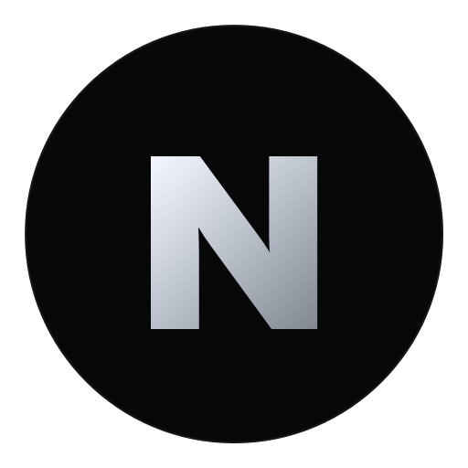

# NOIR MOTION - Landing Streetwear

<p align="center">
  
</p>

<p align="center">
  <b>Accesorios streetwear unisex con actitud urbana.</b><br/>
  Proyecto frontend en HTML, CSS y JavaScript puro, diseñado para una marca moderna, oscura y premium.
</p>

<p align="center">
  
  
  
  
</p>

---

## Que estoy construyendo

Estoy desarrollando una **landing page completa para NOIR MOTION**, una tienda de accesorios de moda streetwear.  
La idea principal es combinar:

- estetica minimalista urbana
- alto contraste (negro + plateado metalico)
- experiencia visual premium
- copy directo en espanol
- microinteracciones modernas sin frameworks

---

## Vista del proyecto

### Hero / Campana urbana


### Catalogo curado


### Identidad de marca y estilo


---

## Caracteristicas destacadas

- **Landing one-file**: todo concentrado en `index.html`
- **Diseno responsive**: enfoque mobile-first real
- **Animaciones suaves**: `IntersectionObserver` + transiciones cuidadas
- **Preloader personalizado**: con `images/noir-motion-logo.png`
- **Favicon de marca**: con `images/noir-favicon.png`
- **Secciones completas**: hero, catalogo, identidad, destacados, galeria, testimonios, redes, mapa y footer

---

## Estructura del proyecto

```bash
Landing-Tienda-Acessorios/
├── index.html
├── README.md
├── .gitignore
├── images/
│   ├── noir-motion-logo.png
│   ├── noir-favicon.png
│   └── generate-logo.ps1
└── notas/
    └── landing_noir_motion_1b6d2ca9.plan.md
```

---

## Como abrir el proyecto

1. Clona o descarga este repositorio.
2. Abre la carpeta en tu editor.
3. Ejecuta `index.html` en el navegador.

No necesitas instalar dependencias ni usar build tools.

---

## Proximos pasos

- agregar seccion de carrito o wishlist
- conectar productos a un JSON local o API
- optimizar imagenes con versiones WebP
- sumar modo claro/oscuro opcional

---

## Autor

Proyecto creado por **Jonathan** para construir una presencia digital de marca streetwear con identidad fuerte y estilo internacional.
